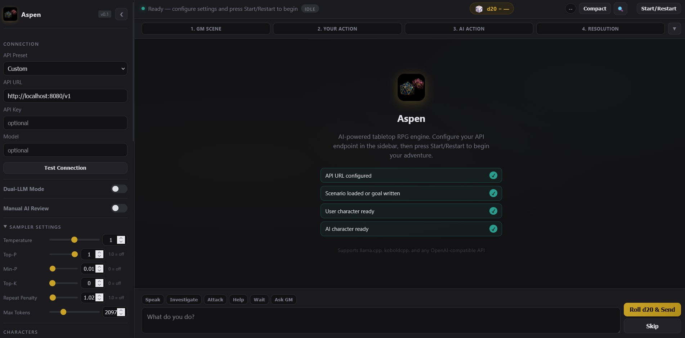

# Aspen

Aspen is a lightweight browser interface for running AI-driven tabletop RPG scenarios with a human player, an AI player, and an AI Game Master.

Aspen is designed to be portable: open the HTML file in a browser, point it at any OpenAI-compatible API endpoint, import character/scenario JSON files, and play.

## Features

- Single-file RPG interface in `index.html`
- OpenAI-compatible API support
- Presets for `llama.cpp` and `koboldcpp`
- Optional Dual-LLM mode for separate GM and AI Player endpoints
- Character card import, including Aspen and TavernAI/SillyTavern-style JSON
- Scenario/world import with a persistent Scenario Goal
- Session notes scratchpad for clues, NPCs, promises, and reminders
- Editable Story Summary memory with manual update from older history
- Save export/import, including session notes and story summary
- Settings and UI preferences auto-saved to localStorage (persists across refreshes)
- Toast notifications (non-blocking feedback for all operations)
- Quick Start samples and setup checklist to try the app immediately
- Test Connection button to verify API setup
- Manual AI Review mode for editing or regenerating AI player actions
- Manual GM Review mode for editing or regenerating GM narration/resolution before it is added to the story
- Round-based flow: GM sets the scene, user acts, AI acts, then GM resolves both actions together
- Recent context window keeps LLM prompts focused on the latest 12 story entries while preserving the full visible/save history
- Turn phase tracker showing GM Scene, Your Action, AI Action, and Resolution
- Collapsible sampler/settings sidebar and collapsible play HUD
- Character presence cards and pending round summary
- Story search, Story/Compact density toggle, and recent roll history
- Action starter chips for common tabletop actions
- Optional d20 modifiers from `-19` to `+19` for the user and AI player
- Undo Round and Re-roll GM controls

## Quick Start

1. Open `index.html` in your browser.
2. In the left sidebar, choose an API preset or enter a custom API URL.
3. Click **Test Connection** to verify your API is reachable.
4. Enter a model name if your backend requires one.
5. Import a scenario from `scenarios/`, use a **Quick Start** sample, or type a Scenario Goal manually.
6. Import character cards from `cards/`, use a Quick Start sample, or use the default player names.
7. Click **Start/Restart** to have the GM begin the scene.
8. Type your action, click **Roll d20 & Send**, then let the AI player act.
9. The GM will resolve both player actions together and continue the scenario.
10. Use the story summary button to keep context manageable. This application is very context hungry!



## API Setup

Aspen expects an OpenAI-compatible chat completions endpoint.

Common local presets:

| Backend | API URL |
| --- | --- |
| llama.cpp | `http://localhost:8080/v1` |
| koboldcpp | `http://localhost:5001/v1` |

The app sends requests to:

```text
{API_URL}/chat/completions
```

API keys are optional for local backends. If your endpoint requires one, enter it in the API Key field.

## How Turns Work

Aspen uses a round-based sequence:

```text
GM scene -> User action + roll -> AI action + roll -> GM resolves both -> next user action
```

The GM does not resolve the user action immediately. Instead, Aspen waits for the AI player to declare an action too, then sends both actions and rolls to the GM in one round-resolution prompt.

This keeps the AI player involved in the same scene beat and avoids having the GM skip over them.

To keep long sessions lighter, Aspen sends an optional Story Summary plus only the latest 12 story log entries to GM and AI prompts. Use **Update Summary** to merge older history into the summary. The full story remains visible in the app and is still included in exported saves.

## Importing Content

### Character Cards

Use **Import Character Card** to load JSON character files. Aspen supports:

- Aspen character JSON
- TavernAI/SillyTavern-style JSON with `data.name`, `data.description`, `data.personality`, and related fields

When importing, Aspen asks whether the card should be assigned to the AI Player. Cancel assigns it to the User Player.

See [CREATE_CHARACTER.md](docs/CREATE_CHARACTER.md) for the character card format.

### Scenarios

Use **Import Scenario** to load a scenario/world JSON file. Scenarios can include:

- Title
- Description
- World info
- Starting scene
- Scenario goal

The Scenario Goal is injected into GM prompts to keep play from drifting.

See [CREATE_SCENARIO.md](docs/CREATE_SCENARIO.md) for the scenario format.

## Saving and Loading

- **Export Save** downloads the current settings, scenario, character cards, session notes, story summary, and game log as JSON.
- **Import Save** restores a previous session.

Because the app runs from a local HTML file, imports use normal browser file pickers. Aspen does not directly read folders from disk.

## Manual AI Review

When **Manual AI Review** is enabled:

1. The AI player drafts an action.
2. Aspen opens a review modal.
3. You can edit the action, regenerate it, or confirm it.
4. Aspen rolls for the AI and asks the GM to resolve the round.

This is useful if you want more control over the AI companion's behavior.

## Manual GM Review

When **Manual GM Review** is enabled, Aspen pauses before adding GM narration or round resolution to the story log. You can edit the response, re-roll it from the same prompt, or confirm it.

This is useful for steering tone, correcting continuity, or keeping the GM from overreaching before the text becomes part of the visible story.

## Project Files

```text
Aspen/
├── index.html                  Main app (open this in your browser)
├── character-creator_v1.html   Character card helper
├── scenario-creator.html       Scenario helper
├── cards/                      Example/importable character cards
├── scenarios/                  Example/importable scenarios
├── saves/                      Suggested place for exported saves
├── docs/                       Guides and implementation notes
└── AGENTS.md                   Architecture and development reference
```

## Documentation

- [GM_logic.md](docs/GM_logic.md) explains the GM/user/AI round flow.
- [CREATE_CHARACTER.md](docs/CREATE_CHARACTER.md) explains character card creation.
- [CREATE_SCENARIO.md](docs/CREATE_SCENARIO.md) explains scenario creation.
- [AGENTS.md](AGENTS.md) contains architecture notes for development.

## Development Notes

- No build step is required.
- The main app is plain HTML, CSS, and JavaScript.
- Edit `index.html` directly.
- Run dependency-free tests with `node --test "tests/*.test.js"`.
- Settings are auto-persisted to `localStorage` under the key `aspen_session`.
- If you change prompt architecture or turn sequencing, update `AGENTS.md` and `docs/GM_logic.md`.
- If testing API calls, make sure your local backend allows browser requests from a `file://` page or use a local static server.

## Troubleshooting

### The GM does not respond

Check that:

- Your API backend is running.
- The API URL includes `/v1` if your backend expects it.
- The selected model name matches your backend.
- Your backend supports `/chat/completions`.
- CORS/browser access is enabled for local requests.

### The AI player feels out of sequence

The intended sequence is user declaration first, AI declaration second, GM resolution third. See [GM_logic.md](docs/GM_logic.md) for the full flow.

### Imports do not load

Make sure the file is valid JSON and matches one of the supported formats. The browser file picker is required because local HTML pages cannot freely read folders from disk.
